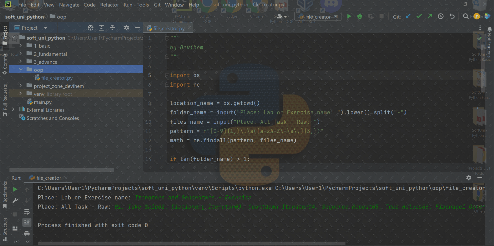

## created to work , not to look good
 
 raw scripts , nothing spcecial , only for text extraxt and file creating  / softuni courses
Tested on Windows  for Linux or Mac you must change the slashes for dir

## !!! Most important , copy the exact same line of text !!!

1 - Place the file in the folder of your current course.

2 - Run ( the file , not you )

3 - Copy the course name from Judge

4 - Copy all task names from Judge

5 - Make a coffee

